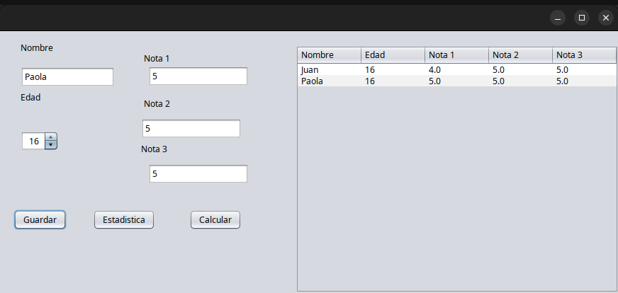

# Proyecto: Registro y Estadísticas de Estudiantes en Java Swing

Este proyecto permite registrar estudiantes, visualizar la lista en una tabla y calcular estadísticas académicas usando Java Swing y NetBeans. Se aplican buenas prácticas de POO y separación de responsabilidades.

---

## Estructura del Proyecto

- **domain**: Clases de modelo (`Estudiante`, `Nota`)
- **service**: Lógica de negocio (`RegistroEstudiantesService`, `CalculoService`)
- **ui**: Interfaz gráfica (`RegistroEstudianteFrame`)

---

## Clases Principales

### Estudiante

Representa a un estudiante con nombre, edad y tres notas.

```java
public class Estudiante {
    private final String id;
    private String nombre;
    private int edad;
    private List<Nota> notas; // exactamente 3

    // Métodos de acceso y validación...
}
```

### Nota

Representa una nota individual, validando que esté entre 0.0 y 5.0.

```java
public final class Nota {
    private final double valor;

    public Nota(double valor) {
        if (valor < 0.0 || valor > 5.0) {
            throw new IllegalArgumentException("La nota debe estar entre 0.0 y 5.0");
        }
        this.valor = valor;
    }

    public double getValor() { return valor; }
}
```

### RegistroEstudiantesService

Gestiona la lista de estudiantes y calcula estadísticas globales.

```java
public class RegistroEstudiantesService {
    private final List<Estudiante> estudiantes = new ArrayList<>();

    public void agregarEstudiante(Estudiante e) { ... }
    public List<Estudiante> listarEstudiantes() { ... }
    public double calcularPromedioGeneral() { ... }
    public Optional<Estudiante> mejorEstudiante() { ... }
    public long contarAprobados() { ... }
    public long contarReprobados() { ... }
}
```

### CalculoService

Realiza cálculos individuales sobre las notas de un estudiante.

```java
public class CalculoService {
    public double promedio(List<Nota> notas) { ... }
    public Nota notaMaxima(List<Nota> notas) { ... }
    public boolean aprobado(double promedio) { ... }
}
```

---

## Interfaz Gráfica (Java Swing)

La clase principal de la interfaz es `RegistroEstudianteFrame`.  
Los elementos visuales se crean desde el diseñador de NetBeans.

### Componentes principales

- **JTextField**: Para nombre y notas.
- **JSpinner**: Para edad.
- **JButton**: Para guardar estudiante, calcular estadísticas y mostrar resultados individuales.
- **JTable**: Para mostrar la lista de estudiantes.
- **JLabel**: Para mostrar resultados de cálculos individuales.

### Inicialización de la tabla

```java
tableEstudiantes.setModel(new javax.swing.table.DefaultTableModel(
    new Object [][] {},
    new String [] { "Nombre", "Edad", "Nota 1", "Nota 2", "Nota 3" }
));
```

### Método para actualizar la tabla

```java
private void actualizarListaEstudiantes() {
    var modelo = (javax.swing.table.DefaultTableModel) tableEstudiantes.getModel();
    modelo.setRowCount(0); // Limpia la tabla
    for (var est : registroService.listarEstudiantes()) {
        modelo.addRow(new Object[]{
            est.getNombre(),
            est.getEdad(),
            est.getNotas().get(0).getValor(),
            est.getNotas().get(1).getValor(),
            est.getNotas().get(2).getValor()
        });
    }
}
```

---

## Manejo de Errores

El manejo de errores es fundamental para garantizar que la aplicación sea robusta y fácil de usar.  
**¿Para qué sirve?**  
Permite detectar y gestionar situaciones inesperadas, evitando que la aplicación se cierre o muestre resultados incorrectos. Además, ayuda a guiar al usuario para corregir sus entradas.

### Ejemplos de manejo de errores implementados:

- **Validación de campos vacíos:** Antes de registrar un estudiante, se verifica que todos los campos estén completos. Si falta información, se muestra un mensaje claro al usuario usando `JOptionPane`.
- **Conversión de tipos:** Se utiliza `try-catch` para capturar errores al convertir texto a números (por ejemplo, edad y notas). Si el usuario ingresa un valor no numérico, se informa el error y se solicita corregirlo.
- **Rangos válidos:** Las notas se validan para estar entre 0.0 y 5.0. Si se ingresa una nota fuera de rango, se lanza una excepción y se muestra un mensaje descriptivo.
- **Evitar duplicados:** Se puede agregar lógica para evitar registrar estudiantes con el mismo nombre o ID.
- **Errores en la tabla:** Si ocurre un error al actualizar la tabla (por ejemplo, datos corruptos), se captura y se notifica al usuario sin cerrar la aplicación.
- **Cálculos seguros:** Los métodos de cálculo verifican que la lista de notas tenga exactamente tres elementos antes de procesar, evitando errores de índice.
- **Mensajes claros:** Todos los errores y advertencias se comunican al usuario de forma amigable y comprensible.

### Ejemplo de manejo de errores en el registro

```java
try {
    String nombre = txtNombre.getText();
    int edad = Integer.parseInt(txtEdad.getText());
    double nota1 = Double.parseDouble(txtNota1.getText());
    double nota2 = Double.parseDouble(txtNota2.getText());
    double nota3 = Double.parseDouble(txtNota3.getText());

    if (nombre.isBlank()) throw new IllegalArgumentException("El nombre es obligatorio.");

    Nota n1 = new Nota(nota1);
    Nota n2 = new Nota(nota2);
    Nota n3 = new Nota(nota3);

    Estudiante estudiante = new Estudiante(UUID.randomUUID().toString(), nombre, edad, List.of(n1, n2, n3));
    registroService.agregarEstudiante(estudiante);
    actualizarListaEstudiantes();
} catch (NumberFormatException ex) {
    JOptionPane.showMessageDialog(this, "Edad y notas deben ser números válidos.", "Error de entrada", JOptionPane.ERROR_MESSAGE);
} catch (IllegalArgumentException ex) {
    JOptionPane.showMessageDialog(this, ex.getMessage(), "Error de validación", JOptionPane.WARNING_MESSAGE);
} catch (Exception ex) {
    JOptionPane.showMessageDialog(this, "Ocurrió un error inesperado: " + ex.getMessage(), "Error", JOptionPane.ERROR_MESSAGE);
}
```

---

## Flujo de Uso

1. **Registrar estudiante**  
   El usuario ingresa nombre, edad y tres notas, y pulsa "Guardar".  
   El estudiante se agrega a la lista y la tabla se actualiza.

2. **Mostrar lista**  
   La tabla muestra todos los estudiantes registrados, sin sobrescribir los anteriores.

3. **Mostrar estadísticas**  
   Al pulsar "Estadística", se calcula y muestra:
   - Promedio global
   - Mejor estudiante
   - Cantidad de aprobados y reprobados

4. **Cálculo individual**  
   Puedes usar el botón "Calcular" para mostrar el promedio, nota máxima y si el estudiante está aprobado o reprobado, usando los campos actuales.

---

## Buenas Prácticas

- **Validación**: Usa try-catch para manejar errores de conversión y campos vacíos.
- **Modularidad**: Mantén la lógica en las clases de servicio, no en la interfaz.
- **Mensajes claros**: Usa JOptionPane para mostrar mensajes descriptivos al usuario.
- **Pruebas**: Ingresa varios estudiantes y verifica que la tabla y las estadísticas se actualizan correctamente.
- **Manejo de errores**: Implementa validaciones y captura de excepciones para evitar cierres inesperados y mejorar la experiencia del usuario.

---

## Ejemplo Visual



---

**¡Listo! Con esta estructura, ejemplos de código y manejo de errores, puedes implementar y ampliar tu sistema académico en Java Swing de forma profesional